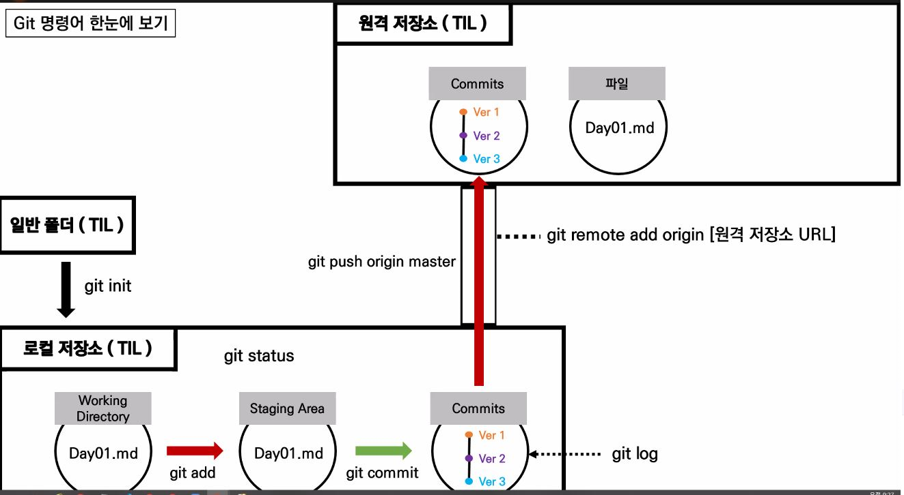
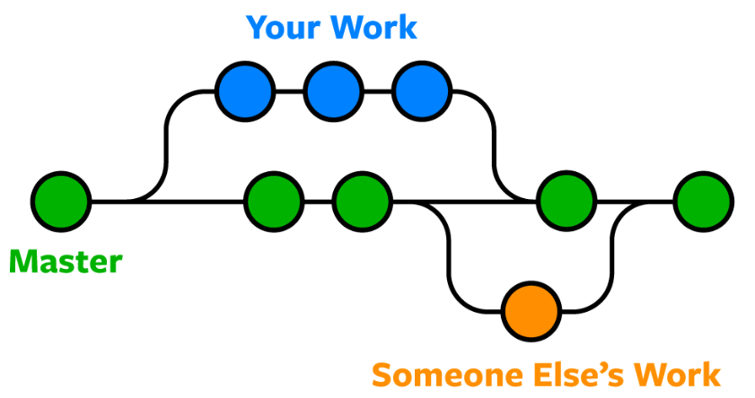

# TIL Day 02

> 2022년 06월 03일 금요일

## git 명령어 기본

1. git init : git으로 관리 시작

   - 디렉토리당 한번만
   - 주의! 홈폴더나 바탕화면 X

2. git status

   - 파일 상태 확인

3. git add 파일명

   - 무대 위로 올리기

4. git commit -m "커밋 사유"

   - 변경 사항을 기록 / 즉, 사진 찍기

5. config 설정

   - git에게 내가 누군지 알려주기(한번만)
   - git config --global user.email "you@example.com"
   - git config --golbal.user.name "Your Name"
   - git config --global --list

6. git log

   - 커밋의 내역 확인
   - --oneline 옵션 사용하여 간단하게 볼 수 있음

7. github과 연결

   - git remote add origin URL

8. github과 연결 확인

   - git remote -v

9. github과 연결 끊기(remote 삭제)

   - git remote rm origin

10. github에 local commits 올리기

    - git push origin master

      

## remote 연결하기

> 로컬 저장소와 원격 저장소 사이에 연결다리 만들어주기

### (github)

1. 레포지토리를 만든다.
2. URL 을 복사한다.

### (local)

1. 레포지토리를 만든다.(폴더 만든 후, git init)
2. README.md 파일을 만든다.
3. 편집 후, add -> commit으로 변경사항을 기록한다.

### (remote와 local 길 연결)

1. git remote add origin URL
   * 주의 : URL은 .git으로 끝나야 함
2. git remote -v

### (local에서 remote로 변경 사항 올리기)

1. git push origin master

## clone, pull, conflict

> 원격 저장소의 repository를 로컬로 복제해 오는 것

1. github에 있는 레포지토리의 url 복사
2. git clone URL
   - 주의!! master 뜬 곳에 하면 안된다 = 레포지토리에서 clone X
3. (local) 수정 add - commit
4. (remote) 수정 add - commit
5. git pull origin master
6. (local) 수정 add - commit
7. (remote) 수정 add - commit
8. git push origin master => rejected 발생!!
9. git pull origin master
10. 에디터상 파랑< >초록 - 파일을 편집하기
11. 저장 - add - commit 충돌을 해결!!
    - git commit -m 'fix conflict'
    - (master|MERGING) -> (master)

## .gitignore

> git으로 관리하지 않는 파일을 설정한다.

- 반드시 이름을 `.gitignore`로 작성한다.
- `.git`폴더와 동일한 위치에 생성한다.
- 주의!!! 제외하고 싶은 파일은 반드시 git add 전에 .gitignore에 작성한다.
- [.gitignore 만들어주는 사이트](https://www.toptal.com/developers/gitignore/)

## Branch

> 작업공간을 나누어 독립된 공간에서 작업 후 합친다.

- 브랜치 목록 확인
  - git branch
- 원격 저장소의 브랜치 목록 확인
  - git branch -r
- 새로운 브랜치 생성
  - git branch <branch name>
- 특정 커밋 기준으로 브랜치 생성
  - git branch <branch name> <commit ID>
- 특정 브랜치 삭제
  - git branch -d <branch name> : 병합된 브랜치
  - git branch -D <branch name> : 강제 삭제(병합되지 않은 브랜치도 삭제 가능)
- 다른 브랜치로 이동
  - git switch <other branch name>
  - 주의!! 이동하기 전에 해당 브랜치의 변경사항 저장!!
- 브랜치를 새로 생성과 동시에 이동
  - git switch -c <branch name>